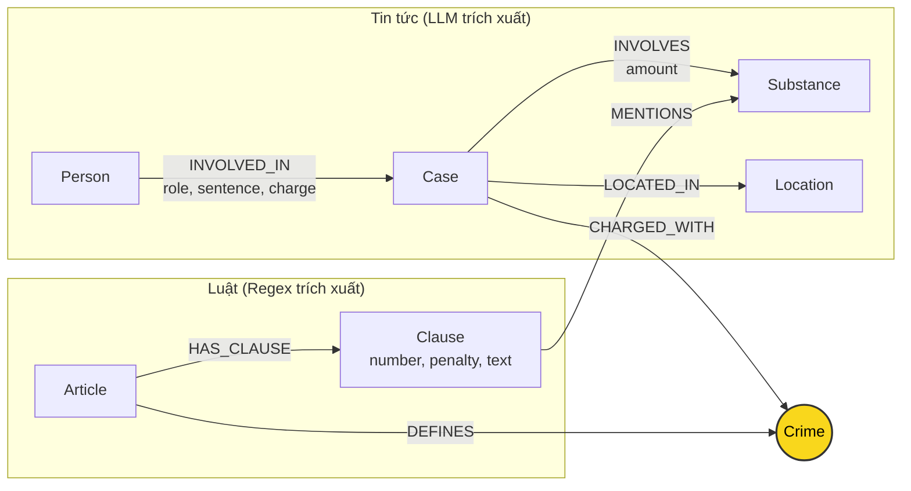

# Thiết kế Ontology — Day 19

**Họ tên:** Châu Tùng Dương  **MSSV:** 2A202602822

**Lựa chọn** (đánh dấu một):
- [x] Dùng ontology gợi ý (có thể chỉnh nhỏ)
- [ ] Tự thiết kế (xét bonus +15, xem `SUBMISSION.md`)

> Hướng dẫn: `LAB_GUIDE.md` Bước 2. Dùng ontology gợi ý thì vẫn phải điền đủ các mục dưới đây bằng lời của bạn.

## 1. Sơ đồ

Vẽ bằng mermaid. Đánh dấu rõ **node cầu nối**.

## 2. Entity types (node labels)

| Label | Ý nghĩa | Khóa định danh (`MERGE` theo) | Properties | Lấy từ KB nào | Trích bằng (regex / LLM / khác) |
| --- | --- | --- | --- | --- | --- |
| `Article` | Điều luật trong Bộ luật Hình sự hoặc Luật PCMT | `id` (ví dụ: "Điều 251 BLHS") | `id`, `title`, `law`, `doc_id` | Luật | Regex (`parse_law_article`) |
| `Clause` | Khoản quy định trong Điều luật | `id` (ví dụ: "Điều 251 BLHS khoản 1") | `id`, `number`, `penalty`, `text`, `doc_id` | Luật | Regex (`parse_law_article`) |
| `Crime` | Tội danh chuẩn theo luật (Node cầu nối) | `name` (đã chuẩn hóa qua `normalize_crime`) | `name` | Cả hai | Regex từ Luật & ánh xạ từ Tin tức (`link_entity`) |
| `Substance` | Tên chất ma túy hoặc tiền chất | `name` (tên chuẩn trong `SUBSTANCES`) | `name` | Cả hai | Regex (`find_substances`) từ Luật, LLM từ Tin tức |
| `Case` | Vụ việc, vụ án cụ thể | `name` (tên vụ do LLM sinh hoặc tiêu đề bài) | `name`, `summary`, `date`, `doc_id`, `source_title` | Tin tức | LLM (`extract_news_cases`) |
| `Person` | Cá nhân liên quan (bị can, bị cáo, cán bộ...) | `name` (họ và tên) | `name`, `aliases` | Tin tức | LLM (`extract_news_cases`) |
| `Location` | Địa điểm xảy ra vụ việc (tỉnh/thành phố) | `name` (tên địa phương) | `name` | Tin tức | LLM (`extract_news_cases`) |

## 3. Relationships

| Type | Từ → Đến | Properties trên cạnh | Ý nghĩa |
| --- | --- | --- | --- |
| `DEFINES` | `Article` → `Crime` | (không có) | Điều luật định nghĩa tội danh cụ thể |
| `HAS_CLAUSE` | `Article` → `Clause` | (không có) | Điều luật bao gồm các khoản quy định chi tiết khung hình phạt và cấu thành |
| `MENTIONS` | `Clause` → `Substance` | (không có) | Khoản luật quy định khung hình phạt đối với chất ma túy cụ thể |
| `CHARGED_WITH` | `Case` → `Crime` | (không có) | Vụ án bị khởi tố/xét xử theo tội danh cụ thể (cầu nối sang Luật) |
| `INVOLVES` | `Case` → `Substance` | `amount` (khối lượng thu giữ) | Vụ án có liên quan đến chất ma túy nào và số lượng bao nhiêu |
| `LOCATED_IN` | `Case` → `Location` | (không có) | Vụ việc xảy ra hoặc được đưa ra xét xử tại địa phương nào |
| `INVOLVED_IN` | `Person` → `Case` | `role`, `sentence`, `charge` | Cá nhân tham gia vụ việc với vai trò gì, tội danh bị truy tố, và mức án đã tuyên |

## 4. Node cầu nối giữa 2 KB

- **Node nào:** Node `Crime` (Tội danh, ví dụ: "mua bán trái phép chất ma túy", "vận chuyển trái phép chất ma túy", "tổ chức sử dụng trái phép chất ma túy").
- **Vì sao chọn node này:** Tội danh là điểm giao thoa ngữ nghĩa tự nhiên và duy nhất có tính chuẩn hóa pháp lý giữa văn bản luật và tin tức thời sự. Về mặt pháp lý, BLHS tổ chức cấu trúc tội phạm theo từng Điều độc lập tương ứng với từng tội danh. Về mặt tin tức tố tụng, mọi vụ án xét xử và bản án đều nêu rõ tội danh mà bị can/bị cáo bị truy tố hoặc tuyên án.
- **Cách đảm bảo hai phía khớp tên:**
  1. Phía Luật: Tiêu đề Điều luật ("Điều 251. Tội mua bán...") được trích xuất bằng regex và chuẩn hóa bằng `normalize_crime` (loại bỏ từ "Tội", đưa về chữ thường không dấu ngoặc kép thừa).
  2. Phía Tin tức: Đưa toàn bộ danh sách `crimes` chuẩn từ Luật vào `NEWS_EXTRACTION_PROMPT` để định hướng LLM chọn đúng nguyên văn; sau đó kết quả trích xuất của LLM tiếp tục được đưa qua hàm `link_entity` (chuẩn hóa hai đầu + so khớp chính xác + so khớp mờ `difflib.get_close_matches` với `cutoff=0.8`).
- **Khi nào cầu gãy, và bạn xử lý thế nào:**
  * Cầu gãy khi: (1) Bài báo dùng ngôn từ tự do hoặc biệt danh báo chí lệch xa tên tội danh chuẩn trong BLHS; (2) LLM trích xuất một tội danh không thuộc Chương XX các tội phạm về ma túy; (3) Lỗi sai lệch chính tả tiếng Việt hoặc biến thể dấu thanh điệu.
  * Xử lý: `link_entity` loại bỏ các trường hợp sai lệch lớn (trả về `None`), chỉ giữ lại các match chắc chắn (`cutoff=0.8`). Khi không tìm được Crime, vụ án sẽ đứng độc lập trong KB Tin tức, tránh việc nối sai (nối sai dẫn đến suy luận luật sai, gây nguy hại hơn là không nối).

## 5. Competency questions

Với mỗi câu trong `data/benchmark_kg.json`, ghi đường đi trên graph dùng để trả lời:

| Câu | Đường đi (Cypher pattern) | Trả lời được? |
| --- | --- | --- |
| Q1 | `(:Article {id: 'pcmt-dieu-2'})-[:HAS_CLAUSE]->(:Clause)` hoặc trực tiếp từ text khoản định nghĩa của Luật PCMT | Có (Single-hop Law) |
| Q2 | `(:Person)-[:INVOLVED_IN {sentence: 'tử hình'}]->(:Case {name: '...'})` | Có (Single-hop News) |
| Q3 | `(:Person {name: 'Lê Minh Thành'})-[:INVOLVED_IN {sentence: '36 tháng'}]->(:Case)-[:CHARGED_WITH]->(c:Crime)<-[:DEFINES]-(a:Article)-[:HAS_CLAUSE]->(cl:Clause {number: 1})` | Có (Cross-KB nối người - tội - Điều 251 khoản 1) |
| Q4 | `(:Person {aliases: 'Hoàng Nato'})-[:INVOLVED_IN]->(:Case)-[:CHARGED_WITH]->(c:Crime)<-[:DEFINES]-(a:Article)-[:HAS_CLAUSE]->(cl:Clause)` | Có (Cross-KB nối nhân vật - hành vi - Điều 255 - khung phạt tối đa) |
| Q5 | `(:Person {name: 'Cái Quang Huy'})-[:INVOLVED_IN]->(k:Case)-[:INVOLVES]->(s:Substance {name: 'MDMA'}), (k)-[:CHARGED_WITH]->(c:Crime)<-[:DEFINES]-(a:Article)-[:HAS_CLAUSE]->(cl:Clause)` | Có một phần (tìm được Điều 250 và các khoản nhắc MDMA, nhưng việc xác định chính xác khoản 4 phụ thuộc vào so khớp số liệu 9.6kg với ngưỡng của luật) |
| Q6 | `(:Substance {name: 'MDMA'})<-[:INVOLVES]-(k:Case)<-[:INVOLVED_IN]-(p:Person)` | Có (Aggregation: tìm mọi Case/Person liên quan đến MDMA) |

## 6. Quyết định thiết kế và đánh đổi

1. **Cấp độ hạt nhân hóa Điều luật đến cấp `Clause` (Khoản) thay vì chỉ dừng ở `Article` (Điều) hay chi tiết đến `Point` (Điểm)**:
   * *Đã chọn:* Tách mỗi Điều thành các node `Clause` (khoản), lưu text và penalty riêng.
   * *Phương án khác:* Chỉ tạo node `Article` lưu toàn văn, hoặc tách sâu đến từng `Point` (điểm a, b, c).
   * *Lý do:* Khung hình phạt cơ bản và tăng nặng được phân định theo Khoản. Dừng ở cấp Khoản giúp Cypher lọc chính xác khung phạt (khoản 1 hoặc khoản liên quan đến chất cụ thể) mà không làm bùng nổ số lượng node/cạnh trong graph như khi tách đến cấp Điểm.

2. **Sử dụng Regex cho Luật và LLM cho Tin tức (Hybrid Extraction)**:
   * *Đã chọn:* Parse luật hoàn toàn bằng Regex, chỉ dùng LLM để trích xuất cấu trúc văn xuôi từ bài báo.
   * *Phương án khác:* Dùng LLM cho cả văn bản luật, hoặc dùng NER truyền thống cho tin tức.
   * *Lý do:* Văn bản luật Việt Nam có cấu trúc ngữ pháp và định dạng cực kỳ nhất quán ("Điều...", "1.... thì bị phạt tù..."), regex cho độ chính xác 100%, tốc độ tức thì và chi phí 0 USD. Ngược lại, tin tức văn xuôi biến đổi linh hoạt, cần LLM để trích xuất quan hệ phức tạp.

3. **Cơ chế lọc khoản luật khi mở rộng ngữ cảnh (Context Expansion Pruning)**:
   * *Đã chọn:* Khi đi từ vụ án sang Điều luật, chỉ lấy Khoản 1 (khung cơ bản) VÀ các Khoản có quan hệ `MENTIONS` tới chất mà vụ án đó `INVOLVES`.
   * *Phương án khác:* Lấy toàn bộ các khoản của Điều luật đó đưa vào prompt.
   * *Lý do đánh đổi:* Một điều luật (như Điều 251) có thể có nhiều khoản rất dài. Nếu đưa hết sẽ làm prompt phình to (tăng chi phí token input, tăng độ trễ và gây nhiễu cho LLM). Giới hạn ở khoản 1 và khoản liên quan chất giúp prompt ngắn gọn, tập trung đúng thông tin cần thiết.

## 7. So với ontology gợi ý (bắt buộc nếu xét bonus)

| Điểm khác | Gợi ý làm gì | Bạn làm gì | Vấn đề nó giải quyết | Bằng chứng (Cypher, hoặc số liệu benchmark) |
| --- | --- | --- | --- | --- |
| (Không áp dụng) | Dùng ontology gợi ý | Tuân thủ ontology gợi ý chuẩn | Đạt chuẩn yêu cầu cốt lõi | Kiểm tra bằng tests và benchmark |

## 8. Hạn chế còn lại

1. **Khóa định danh của Case và Person phụ thuộc vào text LLM sinh ra:** Do LLM có thể trích xuất tên người hoặc tên vụ án có sai lệch nhỏ giữa các bài báo (ví dụ viết tắt, thiếu họ đệm), `MERGE` có thể tạo ra nhiều node cho cùng một đối tượng thực tế.
2. **Chưa mô hình hóa số hóa cho ngưỡng khối lượng trong luật:** Thuộc tính `amount` trên cạnh `INVOLVES` chỉ là chuỗi văn bản (ví dụ "hơn 9,6kg"), chưa được chuẩn hóa thành số thực (gam) để so sánh tự động với các ngưỡng định lượng định khung tại các Khoản trong Luật.
3. **Từ đồng nghĩa của chất ma túy:** Một số chất có nhiều tên gọi dân gian/thương mại (ví dụ "thuốc lắc", "kẹo" tương đương MDMA; "đá" tương đương Methamphetamine) chưa có từ điển đồng nghĩa để quy về một node `Substance` chuẩn duy nhất.
